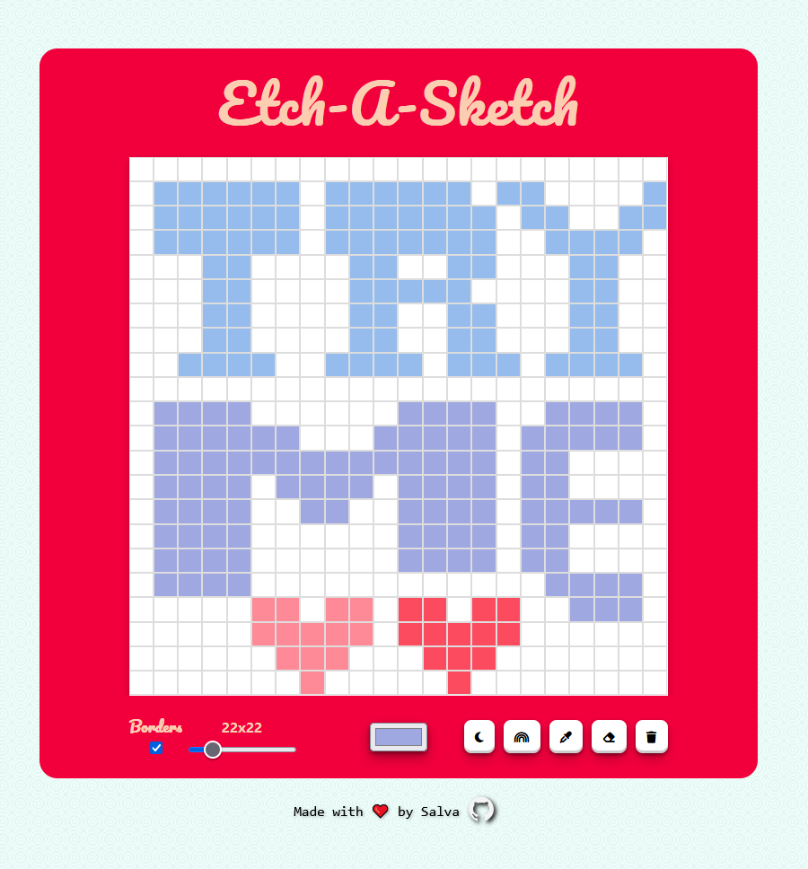

# 🎨 Digital Etch-a-Sketch

An interactive digital sketchpad inspired by the classic Etch-a-Sketch toy, built with HTML, CSS and vanilla JavaScript.

[Check It Out!](https://smad2.github.io/etch-a-sketch/)

   

<div align="center">



*Modern interface with all controls available*

</div>

## ✨ Features

### 🎯 Core Functionality
- **Drag drawing** - Click and drag to draw continuous lines
- **Multiple drawing modes**:
  - 🎨 **Normal Mode** - Customizable color
  - 🌈 **Rainbow Mode** - Random colors from the spectrum
  - 🌑 **Darkening Mode** - Each interaction progressively darkens the cell
  - 🧽 **Eraser** - Reset cells to white
- **Color picker** - Full color palette
- **Eye dropper** - Select existing colors from the canvas

### ⚙️ Advanced Controls
- **Adjustable grid size** - From 10x10 to 80x80 cells
- **Border toggle** - Show/hide grid borders
- **Clear button** - Reset entire canvas
- **Responsive design** - Works on desktop, tablet and mobile

## 🚀 How to Use

### Installation
```bash
# Clone the repository
git clone https://github.com/smad2/etch-a-sketch.git

# Navigate to directory
cd etch-a-sketch

# Open in your browser
open index.html
```

### Basic Controls
1. **Select a drawing mode** by clicking the mode buttons
2. **Adjust grid size** with the slider
3. **Choose a color** with the color picker
4. **Click and drag** on the canvas to draw
5. **Use the eraser** to correct mistakes
6. **Clear everything** with the trash button

## 🛠️ Technologies Used

- **HTML5** - Semantic structure
- **CSS3** -
  - Flexbox for responsive layouts
  - Custom properties (CSS variables)
  - Gradients and shadows for visual effects
  - Transitions and animations
- **JavaScript ES6+** -
  - DOM manipulation
  - Event listeners for interaction
  - Pure and modular functions
  - Touch events support


## 📱 Compatibility

- ✅ Chrome 90+
- ✅ Firefox 88+
- ✅ Safari 14+
- ✅ Edge 90+
- ✅ Mobile devices (touch)

## 🤝 Contributing

Contributions are welcome! Please:

1. Fork the project
2. Create a feature branch (`git checkout -b feature/AmazingFeature`)
3. Commit your changes (`git commit -m 'Add some AmazingFeature'`)
4. Push to the branch (`git push origin feature/AmazingFeature`)
5. Open a Pull Request

## 📝 Roadmap

- [ ] Save/export drawings
- [ ] Different brush sizes
- [ ] Symmetry mode
- [ ] Predefined patterns
- [ ] Color API integration

## 🐛 Reporting Issues

If you find any bugs or have suggestions, please [open an issue](https://github.com/smad2/etch-a-sketch/issues).

## 📄 License

This project is licensed under the MIT License - see the [LICENSE.md](LICENSE.md) file for details.

## 👨‍💻 Author

**Salva Madrid**
- GitHub: [@smad2](https://github.com/smad2)
- Project: [Etch-a-Sketch](https://github.com/smad2/etch-a-sketch)

## 🙏 Acknowledgments

- Inspired by the classic Etch-a-Sketch toy from Ohio Art Company
- The Odin Project for the initial challenge
- Developer community for shared resources

---

<div align="center">

**Like this project? Give it a ⭐ on GitHub!**

</div>